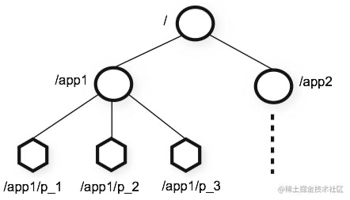
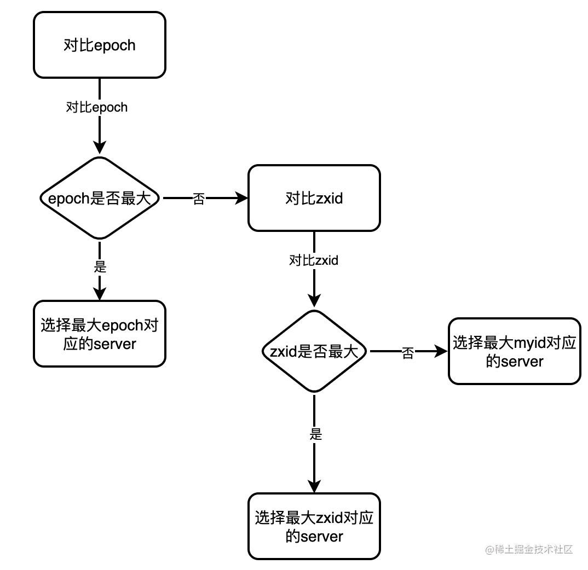
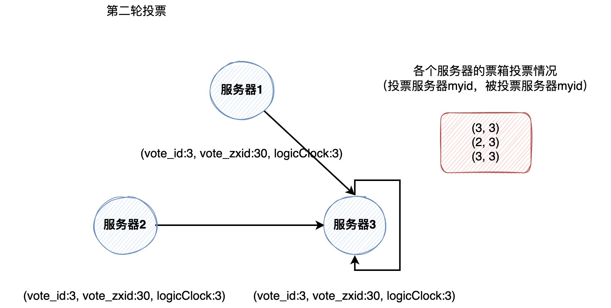
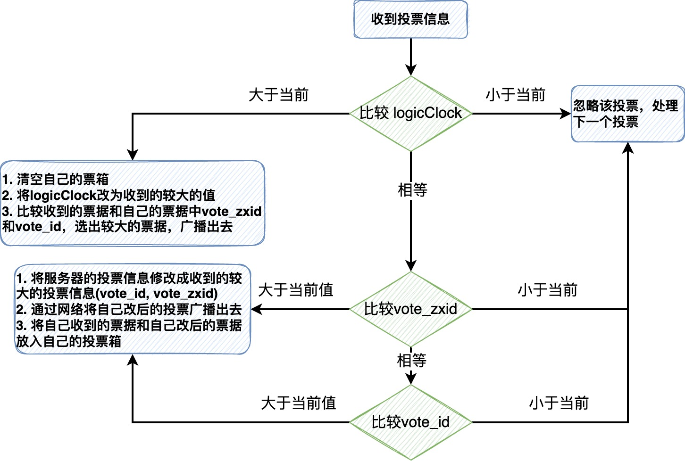
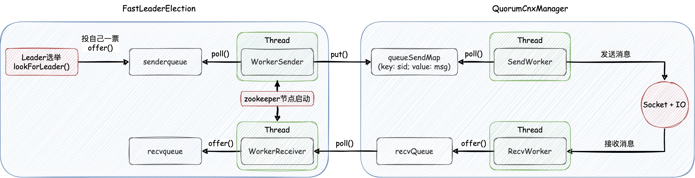
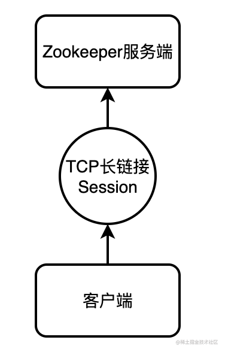
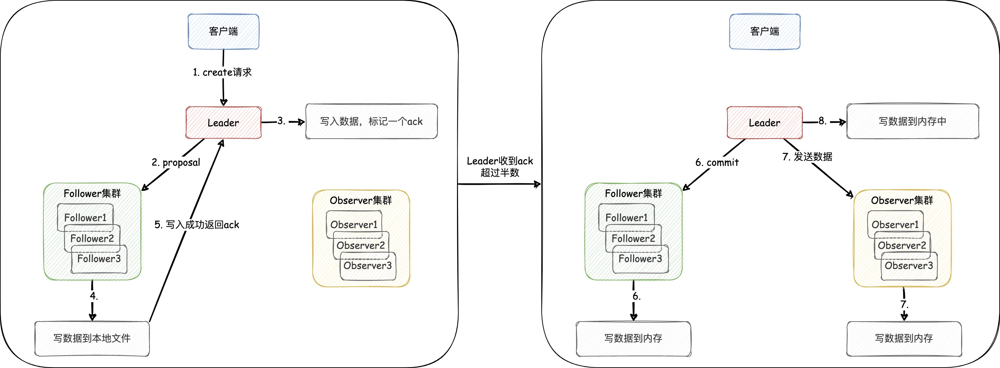
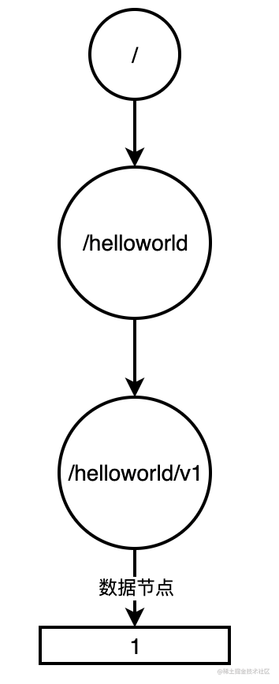

## [深度剖析zookeeper核心原理](https://s.juejin.cn/ds/rVnRsQr/)

## 1. 什么是zookeeper？

**分布式的协调中心**，也叫**注册中心**。它负责**维护集群内元数据**以及**主节点选举**等功能，它能很好地支持集群部署，并且具有很好的分布式协调能力。

zookeeper采用的是CAP理论的**CP模型**，**用服务的可用性来换取数据的相对强一致性**，也就是牺牲一部分可用性来提高数据的一致性。

> 比如一个集群中有5个节点，按照过半原则来说，3个节点及以上算半数。若集群内挂了3台，只保留2台服务，那么此时集群是不能做读写请求的，这是CP的特征之一。
当然，这导致了集群的可用性较低，因为仍然活着两个节点，却不能提供服务。不过zookeeper的选主效率也比较高，根据官方压测结果，它不会超过200ms。

### 1.1 zookeeper的特点

- **支持分布式集群部署**
- **顺序一致性**: 客户端发送的每一个请求到zookeeper都是有序的，在整个集群内都是有序的
- **原子性**: 一个请求在分布式集群中具备原子性，要么所有节点都处理了这个请求，要么都不处理
- **可靠性**: 某台服务器宕机，保证数据的完整性
- **实时性**: 发生数据变更，及时通知客户端，采用的事`Watcher`机制

### 1.2 zookeeper的角色

- **Leader**: **集群之首**，主节点，提供**读写服务**，且写请求只能由Leader来完成，也负责将写请求的数据同步给各个节点。
（每个写请求都会生成一个zxid，将此请求同步给各个Follower和Observer时，是zxid决定了顺序一致性）
- **Follower**: 从节点，仅提供**读能力**，且**能参加选举**
- **Observer**: 也是从节点，仅**提供读能力**，但是**不能参加选举**。它只会接收Leader的同步数据，合理利用它能够提高集群的**读并发能力**


### 1.3 zookeeper的节点类型
znode，可以理解为zookeeper内**存储数据的数据结构**，有持久节点和临时节点两种类型

- **持久节点**: 具备持久化功能，客户端断开链接了也会一直存在，用作元数据存储
- **临时节点**: 基于内存，客户端断开链接了临时节点会自动消失，大多分布式协调工作都是用临时节点来做的。
如果客户端采用zookeeper的 `watch` 机制来监听临时节点，一旦该节点消失，客户端就会收到临时节点被删除的通知，以此来做一些自己的业务逻辑

> **顺序节点**: 顺序节点不过是顺序持久节点或顺序临时节点，如在 `/test` 下创建临时顺序节点，那么会自动为这些子节点编号，且编号自增。
> 临时顺序节点一般用于分布式锁的场景，在加锁时创建一个临时顺序节点，比如 `lock0000000000`，当其他客户端再想获取锁时会自增编号，
> 如 `lock0000000001`，并且会注册 `Watcher` 监听上一个临时顺序节点，当持有锁的客户端断开链接时，那么下一个编号的客户端会收到通知，并尝试获取锁

### 1.4 什么是节点
znode，像Linux的文件系统一样，每个节点都是用一个**路径作为唯一标识**，**每个节点都能保存数据**，**也可以多层级**。



如上图，`/，/app1，/app2`属于三个根节点，`/app1/p_1`属于`/app1`节点的子节点

## 2. Leader选举
- 我们在搭建集群的时候，都会添加如下配置，其中server`.1 .2 .3`这个编号，在选举中会用到，暂且称它为`myid`
>server.1= ZooKeeper 1:2888:3888 </p>
server.2= ZooKeeper 2:2888:3888 </p>
server.3= ZooKeeper 3:2888:3888

- **zxid**: 事务ID，也是选举中会被用到的一个值。每次请求都会使zxid加一，这个zxid设计的很巧妙。
它是64位long类型，前32为代表选举更迭次数（朝代，改朝换代次数）我们称之为`epoch`，后32位记录请求次数，也是事务次数。

初始时是这个样子

`00000000000000000000000000000000 00000000000000000000000000000000`

客户端发起3次请求后，后32位结果为3，如下

`00000000000000000000000000000000 00000000000000000000000000000011`

Leader宕机，选举完成后，更新前32位，加一，并且后32位事务次数归0

`00000000000000000000000000000001 00000000000000000000000000000000`

如果这个服务很坚挺，写请求又很频繁把后32位写满了

`00000000000000000000000000000001 11111111111111111111111111111111`

那么再请求一次，则会将前32位加一

`00000000000000000000000000000010 00000000000000000000000000000000`

zookeeper节点包含的选举状态
- **LOOKING**: 竞选状态，此状态下还没有 Leader 诞生，需要进行 Leader 选举
- **FOLLOWING**: 对应Follower角色，并且它知道Leader是谁
- **OBSERVING**: 对应Observer角色，知道Leader是谁
- **LEADING**: 对应Leader角色

### 2.1 选举流程原理
#### 2.1.1 选举结果依据比较流程图


选举结果比较依据如上图所示，会先比较 `zxid` 的 `epoch`，有大选大，相同的话继续比较事务次数，有大选大，如果还相同的话，那么只能选 `myid` 比较大的节点了

以上比较过程暗含的逻辑: **哪个Follower上的消息最新就让哪个Follower被选为Leader**

#### 2.1.2 选举过程
熟悉了选举的比较依据，那么选举过程是什么样的呢？先来熟悉下选举必要的参数，如下

- **self_myid**: 当前服务器的myid
- **self_zxid**: 当前服务器的zxid
- **vote_id**: 被推荐服务器的myid
- **vote_zxid**: 被推荐服务器的zxid
- **logicClock**: 逻辑时钟，表示的是**发起投票的第几轮**，保存在**内存**中，每轮投票后自增一

以下是选举过程图例，**三台服务器都在LOOKING状态下**，指定服务器1的myid为1，zxid为10，logicClock为1；
服务器2的myid为2，zxid为20，logicClock为2；服务器3的myid为3，zxid为30，logicClock为2

第一轮服务器互相不知道 `myid` 和 `zxid` ，所以都把票投给自己，并把投票信息广播给各个参选的服务器，
投票信息中包含 **vote_id**, **vote_zxid**, **logicClock** 信息


收到各个服务器第一轮的投票信息后，开始处理，过程如下
- 服务器1的 `logicClock` 为1，收到服务器2和3的投票信息，发现自己的 `logicClock` 小，此时会将自己的 `logicClock` 改成2，之后清空自己的票箱，
并比较自己的投票和收到的投票的 `zxid` 和 `myid` ，选一个大的，也就是服务器3，通过网络传给服务器2和服务器3
- 服务器2收到的投票信息中 `logicClock` 分别为1和2，它会将服务器1的投票信息忽略，继续处理服务器3的投票信息，
服务器3的投票信息中 `vote_zxid` 比自己的大，会将自己的投票信息改成服务器3的投票信息，并通过网络传给服务器1和服务器3
另外将收到的票据和自己刚改的票据放入投票箱中
- 服务器3发现收到的投票信息都比自己的投票信息 **"要小"** ，那么它会把票投给自己，并通过网络把投票信息传给服务器2和服务器3

结果如图所示



最终选举结果，如果票数**超过服务器的半数**，那么则选举该节点为Leader节点。
三个节点会结束LOOKING状态，服务器3进入LEADING状态，服务器1和服务器2进入FOLLOWING状态

比较规则判断流程图



### 2.2 选举网络通信原理
zookeeper投票机制是异步的，它会将投票信息放入**队列**，**开启线程异步消费消息进行发送**，网络连接和消息通信借助`Socket + IO流`实现。

流程图如下，右侧 `QuorumCnxManager` 是网络通信 **"组件"**，负责将投票信息在节点间发送和接收，注意各个节点只和比自己myid小的建立连接，避免连接重复；
左侧 `FastLeaderElection` 则负责将投票信息提供给网络通信组件



1. zookeeper启动时，会开启两条线程其中 `WorkerSender` 负责将要发送的消息从 `senderqueue` 中拿出来，放到 `queueSendMap` 中，
其中 key为接收者myid(要让Socket知道发给谁), value为要发送的投票信息； 
`WorkerReceiver` 负责将 `QuorumCnxManager` 中接收到的消息从 `recvQueue` 队列里拿出来放入`recvqueue`
2. `QuorumCnxManager` 也开启两条线程（注意这里是每个连接开启两条线程），`SenderWorker` 负责发，`RecvWorker` 负责接收消息
3. 选举开始时，每个节点都为自己投一票，并放入 `senderqueue` 中， `WorkerSender` 和 `SenderWorker` 则不断的轮询处理要发送的消息，
同样 `RecvWorker` 和 `WorkerReceiver` 也是不断地轮询接收投票信息

## 3. Session


客户端与zookeeper服务端**通过session**建立连接，**用于客户端和服务端之间的通信**。每个与服务器建立链接的客户端都会被分配一个 `sessionID` ，
且全局唯一。 

Session能设置超时时间，如下代码所示，超时时间为 3000ms
```java
ZooKeeper client = new ZooKeeper("127.0.0.1:2181", 3000, null);
```
但是超时时间最好设置为服务器参数 `tickTime` 的整数倍，因为zookeeper的超时检测机制是每`tickTime`时长检测一次，如果 `tickTime` 为4000ms，
那么客户端超时时间会是4000ms，因为在3000ms即将过期时，zookeeper没有触发超时检测机制，不能使该链接过期。 如果在规定时间内
客户端能与服务器进行**心跳**或者**通信(CRUD操作)**，则Session过期时间被刷新，完成"续期"动作。

### 3.1 SessionId的生成原理
```java
public static long initializeNextSessionId(long id) {
    long nextSid;
    nextSid = (Time.currentElapsedTime() << 24) >>> 8;
    nextSid = nextSid | (id << 56);
    if (nextSid == EphemeralType.CONTAINER_EPHEMERAL_OWNER) {
        ++nextSid;  // this is an unlikely edge case, but check it just in case
    }
    return nextSid;
}
```

1. 先将当前时间戳左移24位又无符号右移了8位

比如当前时间戳为 `0000 0000 0000 0000 0000 0001 0111 1111 1011 0101 1010 0011 0101 0110 1001 1000`，
那么左移24位之后为 `0111 1111 1011 0101 1010 0011 0101 0110 1001 1000 0000 0000 0000 0000 0000 0000`，
无符号右移8位为 `0000 0000 0111 1111 1011 0101 1010 0011 0101 0110 1001 1000 0000 0000 0000 0000`，即**中间40位代表当前时间戳**，
无符号右移高位都是补0，这样能够在与id进行位或运算后，**保证前8位是服务器的myid**
> 右移和无符号右移：正数右移补0，负数高位补1，位移完成后，保持符号位不变；无符号右移不论正数还是负数，移位过程中都补零
> （最高位代表符号位，1为负数，0位正数）

2. id为配置文件中配置的myid，比如为2，左移56位后为 `0000 0010 0000 0000 0000 0000 0000 0000 0000 0000 0000 0000 0000 0000 0000 0000`，
进行位或运算后为 `0000 0010 0111 1111 1011 0101 1010 0011 0101 0110 1001 1000 0000 0000 0000 0000`，这样SessionId便计算完了，
**高 8 位确定了所在机器，中间 40 位使用当前时间戳保证单机环境唯一性，最后低 16 位都是 0 可用于并发自增**

- 这个算法能部署多少个节点？
高8位来回答，最高位是0，8位最大的二进制是`0111 1111`，所以最多部署127个节点
- 这个算法最大支持的qps是多少？
**低 16 位都是 0 可用于并发自增**，结合中间40位的当前毫秒数，也就是每毫秒有`1111 1111 1111 1111`次，即65535，那么qps最大为65535000次

## 4. 一次CRUD请求
### 4.1 一次Create请求流程


一次客户端发送Create请求如上图所示
1. 客户端发 `create` 请求到 Leader，即使请求没落到 Leader 上，那么其他节点也会将写请求转发到 Leader
2. Leader 会先发一个 proposal（提议）请求给各个 Follower，且自己将数据写到本地文件
3. Follower 集群收到 proposal 请求后会将数据写到本地文件，写成功后返回给 Leader 一个 ack
4. Leader 发现收到 ack 数大于整个集群的一半了（包含当前 Leader 节点），则重新提交一个 commit 请求给各个 Follower 节点，
发 commit 请求就代表这个数据**可以对外提供**了，该数据在集群内同步情况没问题，此时Leader自己会把数据写到内存中（这时候 Leader 就能提供这份数据给客户端了）
5. Follower 收到 commit 请求后会将数据写到各自节点的内存中，同时Leader会将请求发给 Observer集群，通知 Observer集群 将数据写到内存

采用2PC（两阶段提交）的机制，Leader收到过半Follower的ack消息即认为写入成功，所以**zookeeper没有保证强一致性**，**只是保证了顺序一致性**

### 4.2 顺序一致性的理解

它的实现原理类似2PC（两阶段提交）的机制，采用的是责任链设计模式。假设zookeeper集群中有3个节点，那么一个事务请求进来后首先Leader节点会发 `proposal` 请求给各个 Follower，
只要 Leader 节点收到 Follower 集群返回的 ack 数量（包括Leader节点自身的ack）**过半**后，在这个集群中只要有一个ack由Follower节点返回即过半，
那么 Leader 就会发起 commit 请求到 Follower，通知它们将数据写到内存中， 此时这条数据就能够提供对外访问了，这样它就**没有保证强一致性**。

而zookeeper实现**顺序一致性的原理**是 Leader 会为每个请求生成zxid（事务ID），发送 `proposal` 请求给 Follower，
Follower 会将请求写入到两个先入先出（FIFO）的阻塞队列中，然后发送 ack 给 Leader；当ack过半时，Leader 发送 commit 请求给 Follower，
Follower 会对比zxid和阻塞队列中的zxid，如果不一致的话，需要跟 Leader 重新同步数据，以此来保证严格有序。

zookeeper如何保证强一致性？ zookeeper内有一个 `sync()` 方法，Follower在查询前主动调用这个方法将数据从Leader节点同步过来，
这样再查询就能和Leader节点数据一致来保证强一致性了。

## 5. 持久化
zookeeper会把每次写请求记录到**事务日志**中，达到参数配置的阈值后，生成二进制**快照文件**。

数据的恢复过程是先恢复**快照文件**中的数据，再**增量**恢复补全**事务日志**中记录的数据

### 5.1 事务日志文件
事务文件的文件名格式为`log.zxid`，写在 `dataLogDir` 目录下，如果这个参数没有配置，那么会写在 `dataDir` 目录下。

每一次事务请求（增删改）就会**写一条操作数据**到事务日志，事务日志文件在生成的时候默认大小为64MB，起初用空字符串进行填充，
目的是防止文件大小每次变化都会带来一次磁盘IO，以此来提升性能。

新的日志文件生成的时机有两个：**服务启动**、**当前文件快写满时预创建下一个**。

### 5.2 数据快照文件
数据快照文件名的格式为 `snapshot.zxid.gz` `snapshot.zxid.snappy` `snapshot.zxid` 三种情况，
其中后缀的不同可以通过 `zookeeper.snapshot.compression.method` 进行配置，快照文件写在`dataDir`目录下。

数据快照巧妙采用zxid结尾可以用于**快速文件恢复**，生成快照文件的时候，会开辟新的事务日志文件，新事务日志文件名是快照文件的 zxid+1，
即恢复完数据快照文件中的数据后，可以根据zxid快速找到需要增量恢复的事务日志文件。

创建数据快照文件的时机：`snapCount/2 + 1 <= 当前已经记录的事务日志数量 <= snapCount`，符合**过半随机条件**便会创建文件，
采用这个方法是为了避免整个zookeeper集群都一起生成快照文件，因为转存数据快照文件很耗时也很影响性能；
选举完成后，新 Leader 所在服务器会检查最近一次快照之后是否有事务日志产生，有就对最近的一次事务之前的全量数据做一次数据快照

快照文件中记录的是 `DataTree`，也就是**当前zookeeper节点的内存镜像**，**相当于是基于当前zookeeper节点内存 dump 了一份数据到快照文件**，
它与事务日志的不同是：如果对一个节点先创建再删除，那么**事务日志会创建两条记录**，而**快照文件是不会记录删除节点数据的，只会基于内存保存节点的最新状态**
> `nodes` 是存储数据的 HashMap，它隶属于 `DataTree`，`DataTree` 对象就代表当前zookeeper节点的所有数据内存。快照文件的内容大概是这个样子
> /test/hello node 节点</p>
cZxid 		   = 0x00001 创建这个节点时的事务 ID</p>
ctime 		   = xxxxxxx 创建节点时间</p>
mZxid 		   = 0x00001 最后修改节点的事务 ID</p>
mtime 		   = xxxxxxx 最后修改节点时间</p>
pZxid 		   = 0x01234 该节点最后更新子节点列表的事务 ID</p>
cversion               = 3 该节点子节点列表更新版本号，即子节点列表修改次数</p>
dataversion            = 0 节点数据版本号</p>
aclVersion             = 0 节点访问控制列表版本号</p>
ephemeralOwner         = 0x00000 如果为临时节点，则为节点拥有者的 sessionID，如果不是临时节点则为 0</p>
dataLength 	           = 0 节点数据长度

### 5.3 数据恢复
如果磁盘上存了100个数据快照也并不会把这100个文件都恢复，而是会找到最新的（根据zxid来判断）且没有损坏的文件进行恢复，过程如下

1. 服务启动进行数据恢复，找到最新的100个数据快照文件
2. 逐个检验数据快照文件是否有效
3. 将最新的有效的文件反序列后保存到内存，生成 `DataTree`后，不再对剩下的数据快照文件进行操作
4. 将该数据快照文件的 `zxid + 1` 后，找到事务日志文件对数据进行增量恢复

### 5.4 非Leader节点与Leader节点的数据同步

1. **DIFF**: 直接差异化同步，因为每个非Leader节点也具有持久化的功能，发生宕机重启后，同步宕机期间丢失的数据即可。
根据非Leader节点的事务ID和Leader节点最大的事务ID获取这个区间的数据同步即可，过程如下

> 1. 首先 Leader 先发给 非Leader 节点一个 `DIFF` 请求，此请求用于通知 非Leader 节点进入差异化数据同步流程
> 2. 然后 Leader 会将差异化数据发送给 非Leader 节点，这里会发送两个数据包，分别是 `proposal` 请求和 `commit` 请求
> 3. Leader 发完所有的差异化数据后，会再次发送一个 `NEWLEADER` 请求通知 非Leader 节点说“我已经将所有差异化数据都同步给你了”
> 4. 非Leader 节点收到 `NEWLEADER` 请求后会回复一个 ACK 消息给 Leader ，代表自己已经完成差异化数据的同步
> 5. Leader 在接收到来自这个 非Leader 节点发来的 ACK 消息后，就认为这个 非Leader 节点已经完成了差异化数据同步，同时进入过半等待提交阶段
> 6. 直到集群中有过半的 非Leader 节点都返回给 Leader 这个 ACK 消息，此时 Leader 向所有已经完成数据同步的 非Leader 节点发送一个 `UPTODATE` 指令，
> 用来通知已经完成了差异化数据同步，此时集群已经具备了对外服务的能力

2. **SNAP**: 全量同步，如果zookeeper集群中新加入一个节点，那么在完成寻主之后，这个时候需要Leader节点对它进行全量数据同步
3. **TRUNC**: 回滚同步，非Leader 节点的事务ID大于 Leader节点，需要 非Leader节点 将数据回滚到 Leader节点 的最大事务ID即可
4. **TRUNC + DIFF**: 先回滚再差异化同步

## 6. Watcher机制
`Watcher` 机制（**节点变更的监听回调**）实现的核心组件是 `WatcherManager`，由它来进行管理，使用的是**观察者模式**。它维护了两个 Map ，
其中一个 Map 以节点的 path 为 key， 以 Watcher 列表为 value，主要用于某个节点发生变更后通知监听到此 path 的各个 Watcher；
另一个 Map 以 Watcher 为 key，以 path 列表为 value，主要用于某个 Watcher 断开连接后要删除其监听的所有 path

`Watcher` 的注册时机是客户端在调用 `getData()` 方法的时候

## 7. zookeeper 用到的设计模式

责任链模式、观察者模式、工厂模式、单例模式

## 8. 队列异步缓冲的思想
这种代码设计用于**提高性能**和**解耦**，模拟的是**MQ生产者和消费者的思想**，具体实现借助**内存队列**。

比如，我们现在需要是对业务的增删改操作记录一条Log到数据库，因为入库操作比较耗时，所以可以考虑添加内存队列作为缓冲：将log**写入队列代替直接写库**，
然后**开启一条线程不断的去消费队列**，去写库，**二者操作是隔离的**，而且**日志入库失败也不会影响主业务流程**，**提高性能和解耦**。

---

## 服务端核心参数
- **tickTime**: ZooKeeper 服务器与客户端之间的心跳时间间隔。单位是毫秒。也就是每隔多少毫秒发一次心跳
- **initLimit**：Leader 与 Follower 之间建立连接后，能容忍同步数据的最长时间，即 `n * tickTime` 毫秒
- **syncLimit**：Leader 和 Follower 之间能容忍的最大请求响应时间，单位是 `n * tickTime` 毫秒，如果超过该时长，
则这个Follower会被认为已经挂掉了，会被Leader踢出去

**initLimit**和**syncLimit**都是以**tickTime**为基准配置的，前两者只需配置为n，即代表n个基本单位

- **dataDir**：存放 ZooKeeper 里的数据快照文件的目录
- **dataLogDir**：存储事务日志目录，如果不配置则默认存在**dataDir**目录下
- **snapCount**：多少个事务生成一个快照。默认是 10 万个事务生成一次快照，快照文件存储到 **dataDir** 目录下

`dataLogDir`中的文件记录的是每一次写请求，称为**事务日志**。而 `dataDir` 存储的文件是在事务日志达到 `snapCount` 阈值（过半随机条件）之后，
转存的一份二进制文件，这样做的目的是二进制文件很小，方便恢复，该文件被称为**快照文件**

日志清理的参数配置
- **autopurge.purgeInterval**: 自动清理功能的时间间隔，单位为小时，默认值为 0，表示不开启自动清理的功能
- **autopurge.snapRetainCount**: 每次自动清理时要保留的版本数量。默认值为 3，最小值也为 3

> server.1= ZooKeeper 01:2888:3888
server.2= ZooKeeper 02:2888:3888
server.3= ZooKeeper 03:2888:3888

其中`ZooKeeper 1`为hostname，之后配置的两个端口号，2888和3888含义如下
- **2888**: 用于Leader和Follower之间进行数据通信
- **3888**: 在集群恢复模式下进行Leader选举投票
- **cnxTimeout**：默认5000毫秒，配置3888端口建立连接的超时时间

- **jute.maxbuffer**：默认是 1mb, 1048575(bytes), 一个节点能保存的最大数据大小
- **maxClientCnxns**：最大与zookeeper服务端的建立的连接数，默认是 60 个


## 基础命令
```shell
# 创建持久节点
create /helloworld
# 创建持久节点v1 并赋值保存值1
create /helloworld/v1 1

# 展示 / 节点下的所有节点
ls /

# 获取/helloworld/v1 的值
get /helloworld/v1
```
- 执行完以上命令，节点如下图所示



```shell
# 创建临时节点
create -e /helloworld2

# 创建顺序节点
[zk: localhost:2181(CONNECTED) 1] create -s /helloworld/v3
Created /helloworld/v30000000001
[zk: localhost:2181(CONNECTED) 2] create -s /helloworld/v3
Created /helloworld/v30000000002

# 版本
version

# 为节点设置值
set /helloworld hi

# 删除一个节点
delete /helloworld

# 查看节点状态
stat /helloworld
cZxid：创建znode节点时的事务ID。
ctime：znode节点的创建时间。
mZxid：最后修改znode节点时的事务ID。
mtime：znode节点的最近修改时间。
pZxid：最后一次更改子节点的事物id（修改子节点的数据节点不算）
cversion：对此znode的子节点进行的更改次数。
dataVersion：该znode的数据所做的更改次数。
aclVersion：此znode的ACL进行更改的次数。
ephemeralOwner：如果znode是ephemeral（临时）节点类型，则这是znode所有者的Session ID。 如果znode不是ephemeral节点，则该字段设置为零。
dataLength：znode数据节点的长度。
numChildren：znode子节点的数量。

# 退出客户端
quit
```