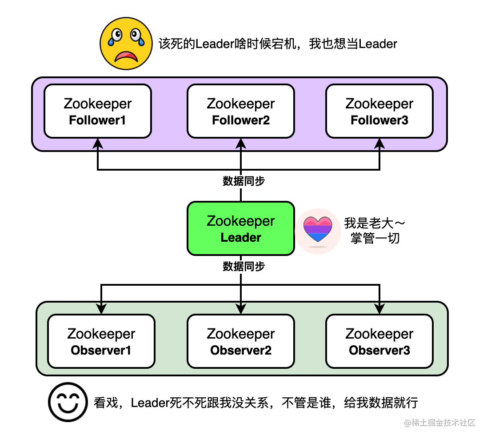

## [深度剖析zookeeper核心原理](https://s.juejin.cn/ds/rVnRsQr/)

## 1. 什么是zookeeper？

**分布式的协调中心**，也叫**注册中心**。它负责**维护集群内元数据**以及**主节点选举**等功能，它能很好地支持集群部署，并且具有很好的分布式协调能力。

zookeeper采用的是CAP理论的**CP模型**，**用服务的可用性来换取数据的相对强一致性**，也就是牺牲一部分可用性来提高数据的一致性。

> 比如一个集群中有5个节点，按照过半原则来说，3个节点及以上算半数。若集群内挂了3台，只保留2台服务，那么此时集群是不能做读写请求的，这是CP的特征之一。
当然，这导致了集群的可用性较低，因为仍然活着两个节点，却不能提供服务。不过zookeeper的选主效率也比较高，根据官方压测结果，它不会超过200ms。

### 1.1 zookeeper的特点

- **支持分布式集群部署**
- **顺序一致性**: 客户端发送的每一个请求到zookeeper都是有序的，在整个集群内都是有序的
- **原子性**: 一个请求在分布式集群中具备原子性，要么所有节点都处理了这个请求，要么都不处理
- **可靠性**: 某台服务器宕机，保证数据的完整性
- **实时性**: 发生数据变更，及时通知客户端，采用的事`Watcher`机制

### 1.2 zookeeper的角色

- **Leader**: **集群之首**，主节点，提供**读写服务**，且写请求只能由Leader来完成，也负责将写请求的数据同步给各个节点。
（每个写请求都会生成一个zxid，将此请求同步给各个Follower和Observer时，是zxid决定了顺序一致性）
- **Follower**: 从节点，仅提供**读能力**，且**能参加选举**
- **Observer**: 也是从节点，仅**提供读能力**，但是**不能参加选举**。它只会接收Leader的同步数据，合理利用它能够提高集群的**读并发能力**



### 1.3 zookeeper的节点类型
znode，可以理解为zookeeper内**存储数据的数据结构**，有持久节点和临时节点两种类型

- **持久节点**: 具备持久化功能，客户端断开链接了也会一直存在，用作元数据存储
- **临时节点**: 基于内存，客户端断开链接了临时节点会自动消失，大多分布式协调工作都是用临时节点来做的。
如果客户端采用zookeeper的 `watch` 机制来监听临时节点，一旦该节点消失，客户端就会收到临时节点被删除的通知，以此来做一些自己的业务逻辑

> **顺序节点**: 顺序节点不过是顺序持久节点或顺序临时节点，如在 `/test` 下创建临时顺序节点，那么会自动为这些子节点编号，且编号自增。
> 临时顺序节点一般用于分布式锁的场景，在加锁时创建一个临时顺序节点，比如 `lock0000000000`，当其他客户端再想获取锁时会自增编号，
> 如 `lock0000000001`，并且会注册 `Watcher` 监听上一个临时顺序节点，当持有锁的客户端断开链接时，那么下一个编号的客户端会收到通知，并尝试获取锁

### 1.4 什么是节点
znode，像Linux的文件系统一样，每个节点都是用一个**路径作为唯一标识**，**每个节点都能保存数据**，**也可以多层级**。


如上图，`/，/app1，/app2`属于三个根节点，`/app1/p_1`属于`/app1`节点的子节点

### 1.5 什么是Session


客户端与zookeeper服务端**通过session**建立连接，每个与服务器建立链接的客户端都会被分配一个sessionID，且全局唯一。
而且session也能设置超时时间，如果在规定时间内客户端没能与服务器进行心跳或者通信，则链接失效。

## 命令
```shell
# 创建持久节点
create /helloworld
# 创建持久节点v1 并赋值保存值1
create /helloworld/v1 1

# 展示 / 节点下的所有节点
ls /

# 获取/helloworld/v1 的值
get /helloworld/v1
```
- 执行完以上命令，节点如下图所示


```shell
# 创建临时节点
create -e /helloworld2

# 创建顺序节点
[zk: localhost:2181(CONNECTED) 1] create -s /helloworld/v3
Created /helloworld/v30000000001
[zk: localhost:2181(CONNECTED) 2] create -s /helloworld/v3
Created /helloworld/v30000000002
```